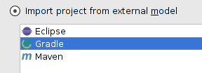
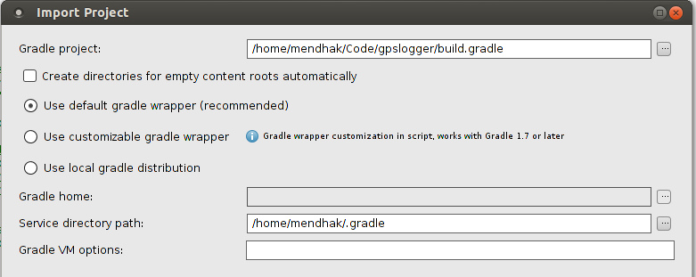
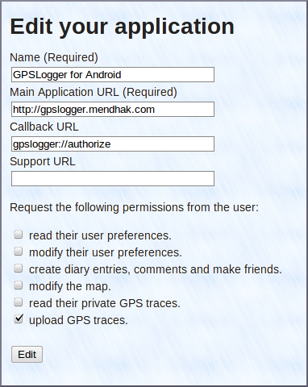
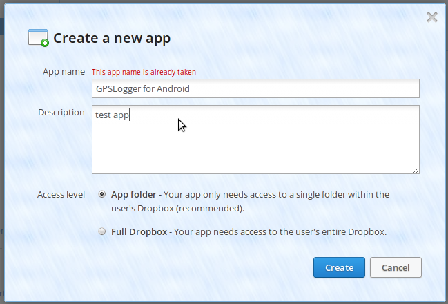
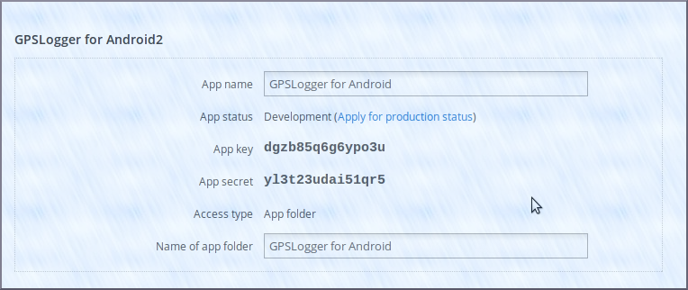
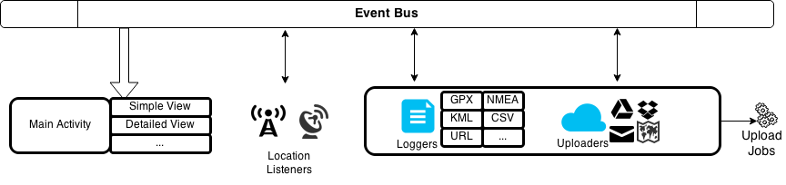

GPSLogger 
=========

GPSLogger is an Android app that logs GPS information to GPX, KML or text files and has options for annotating and sharing.

[Read about GPSLogger here](http://mendhak.github.com/gpslogger/)

## Download

You can [download it from Google Play](https://play.google.com/store/apps/details?id=com.mendhak.gpslogger).

You can download the APK directly [from the releases](https://github.com/mendhak/gpslogger/releases). The oldest Android 2.x release is [here](https://github.com/mendhak/gpslogger/releases/tag/v43).

## Contribute

You can help with [translations](http://crowdin.net/project/gpslogger-for-android)

You can also submit [pull requests](https://help.github.com/articles/using-pull-requests) for bug fixes and new features.

## License

Licensed under [GPL v2](http://www.gnu.org/licenses/gpl-2.0.html).

## Donate

You can donate Bitcoins [here](https://www.coinbase.com/mendhak)

Setting up the code
=========

The project is based on the new [Android build system](http://tools.android.com/tech-docs/new-build-system/user-guide) plugin for Gradle.
Feel free to adopt and document your own OS and IDEs.  These instructions are for Ubuntu Linux with IntelliJ IDEA.

### Set up your Android Development Environment

Follow the instructions on the [Android Developer Website](http://developer.android.com/sdk/installing/index.html) to set up your computer for development.

On Ubuntu 64bit, you may also need `ia32-libs`, follow [these instructions](http://stackoverflow.com/a/21956268/974369).  I did not need this for Ubuntu 14.04.

Download and install [IntelliJ IDEA Community Edition](http://www.jetbrains.com/idea/download/index.html), which is free.
Note that the Android build system version 0.9 does not work well with anything earlier than IntelliJ 13.1.2.

### Get the Android SDK extra repositories

This project uses certain Google libraries, you will need to add them. Run

    <AndroidSDK>/tools/android

Which brings up the Android SDK manager.  In here, choose

*  Tools > Android SDK build tools 19.0.3
*  Extras > Android Support Repository
*  Extras > Android Support Library
*  Extras > Google Play services
*  Extras > Google Repository

### Clone the GPSLogger repository

    git clone git://github.com/mendhak/gpslogger.git

### Create local.properties

IntelliJ/Android Studio [may not detect](http://stackoverflow.com/questions/19794200/gradle-android-and-the-android-home-sdk-location) your `ANDROID_HOME` environment variable, so create a file called `local.properties`, pointing at your Android SDK directory.

    cd gpslogger
    echo "sdk.dir=/home/mendhak/Programs/Android" > local.properties

### Import the project

Open up IntelliJ and choose to import a project.  Select the topmost `build.gradle` file under GPSLogger.

If you get an Import dialog, choose to *Import project from external model*

On the next screen, choose the defaults and proceed (default gradle wrapper)

Give it a minute and IntelliJ/Gradle will configure the projects and download the various libraries.

IntelliJ may not know where your Android SDK is.  You can find this under *File > Project Structure...* where you should set the Project SDK.  You will want to use Java 1.6 with Android 4 or above.

### OpenStreetMap Setup (Optional)

Sign up for an account with [OpenStreetMap](http://openstreetmap.org) and log in.

Click on 'oauth settings'

Click on 'Register your application'

Fill in the form with these details

After registering the application, you will receive a 'Consumer Key' and a 'Consumer Secret'.  
Place the keys in your `~/.gradle/gradle.properties` like this:

    GPSLOGGER_OSM_CONSUMERKEY=abcdefgh
    GPSLOGGER_OSM_CONSUMERSECRET=1234123456

### Dropbox Setup (Optional)

Sign up for an account with Dropbox.com

Go to the [Dropbox Developers page](https://www.dropbox.com/developers/apps) and click on 'Create an App'

Use these settings, but choose a unique name

After creating the app, you will receive an app key and secret (the ones in the screenshot are fake)

Place the keys in your `~/.gradle/gradle.properties` like this:

    GPSLOGGER_DROPBOX_APPKEY=abcdefgh
    GPSLOGGER_DROPBOX_APPSECRET=1234123456

Replace the Dropbox app key to your AndroidManifest.xml file

    <!-- Change this to be db- followed by your app key -->
    <data android:scheme="db-12341234"/>

### Google Docs/Drive Setup (Optional)

Go to the [Google APIs Console](https://code.google.com/apis/console/) and create a new project.

After registering a project, click on API Access and click the 'Create another Client ID' button

Choose "Installed Application" and then under Installed Application Type, choose "Android".  Follow the instructions under
[Learn More](https://developers.google.com/console/help/#installed_applications) to specify the package name and
the SHA1 fingerprint of your debug certificate.

The Google Docs feature requires the [Google Play Services Framework](http://developer.android.com/google/play-services/index.html),
so ensure that the emulator you are using is Android 4.2.2 (API level 17) or greater if you want to use this feature.

You can also debug directly against your phone - all phones Android 2.2 and above should have this framework installed.

Overview
======

GPSLogger is composed of a few main components;

### Event Bus

The Event Bus is where all the cross communication happens.  Various components raise their events on the Event Bus, 
and other parts of the application listen for those events.  The most important one is when a location is obtained, 
 it is placed on the event bus and consumed by many fragments.

### GPS Logging Service

GPSLoggingService is where all the work happens.  This service talks to the location providers (network and satellite).
It sets up timers and alarms for the next GPS point to be requested.  It passes location info to the various loggers
so that they can write files.  It also invokes the auto-uploaders so that they may send their files to Dropbox, etc.

It also passes information to the Event Bus.

### GPS Main Activity

This is the main visible form in the app.   It consists of several 'fragments' - the simple view, detailed view and big view.

It takes care of the main screen, the menus and toolbars.

The fragments listen to the Event Bus for location changes and display it in their own way.

### Session and AppSettings

Floating about are two other objects.  `Session` contains various pieces of information related to the current GPSLogger run,
such as current file name, the last known location, satellite count, and any other information which isn't static but is
needed for the current run of GPSLogger.

`AppSettings` is a representation of the user's preferences.

These objects are visible throughout the application and can be accessed directly by any class, service, activity or fragment.
