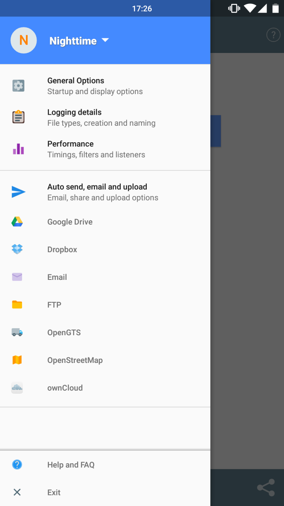

### Menus

Many menu items

**Profiles** - Group preferences under profile names, such as default, nighttime, trekking, etc.

**General options** - Startup, imperial, debug file and version info

**Logging details** - File formats, folder, new file creation, frequency, accuracy

**Auto send, email and upload** - Settings for various destinations such as Custom URL, SFTP, OpenStreetMap, FTP, Dropbox etc
