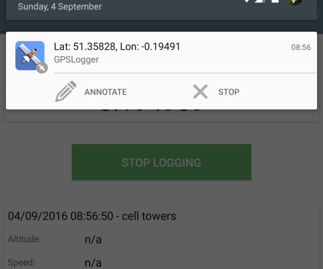

## Why can't I remove the notification?

As of newer versions of Android, removing the notification will cause the service to be killed. As a result, the notification now needs to stay there. You may have seen a recent increase in the number of apps that need to sit in the notification bar for the same reason - to perform background services without being killed.  

There is an option in the app's settings that allows you to remove the notification buttons if you want a smaller notification.  